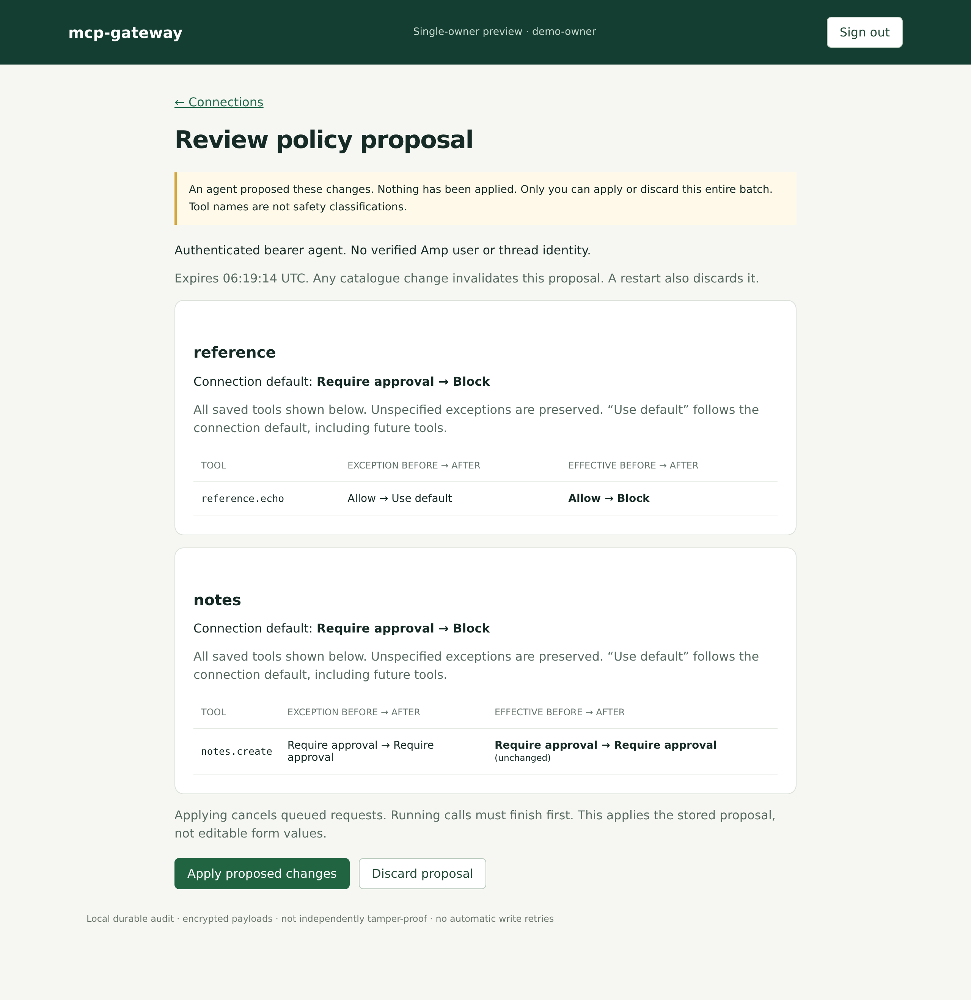
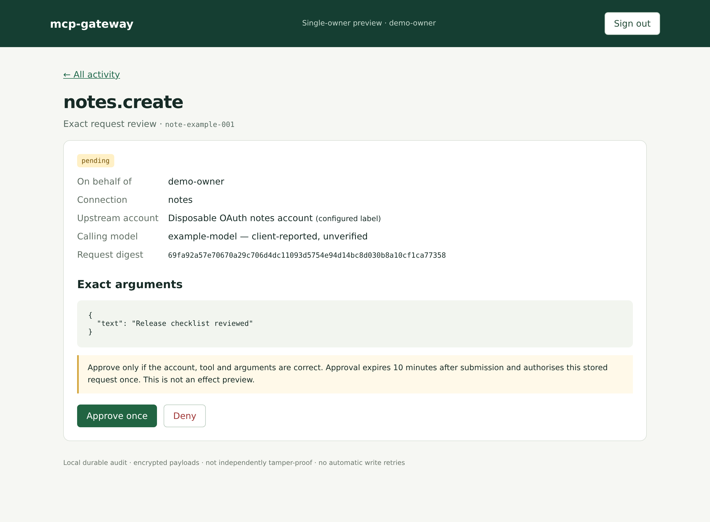
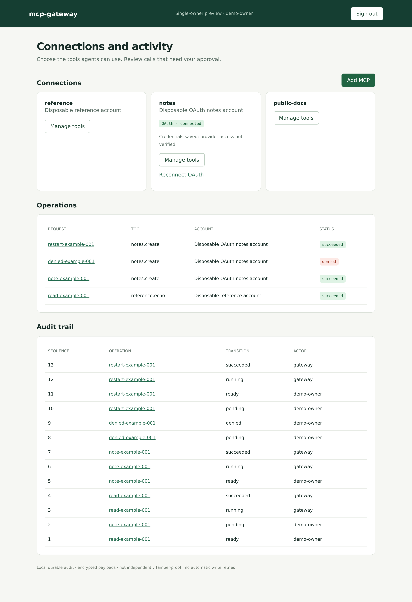
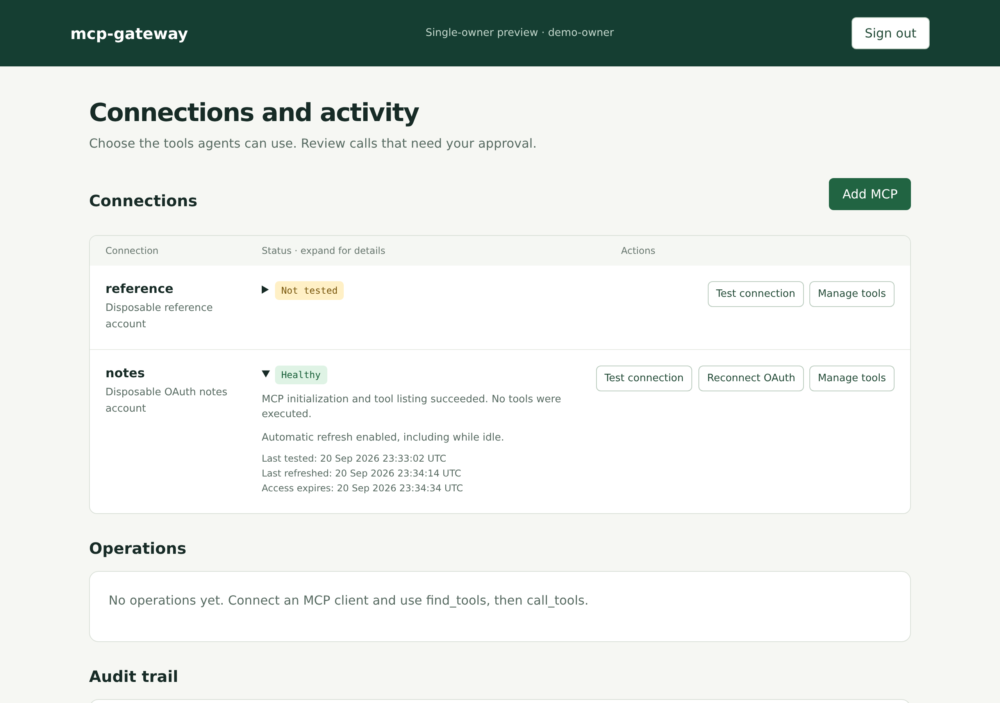
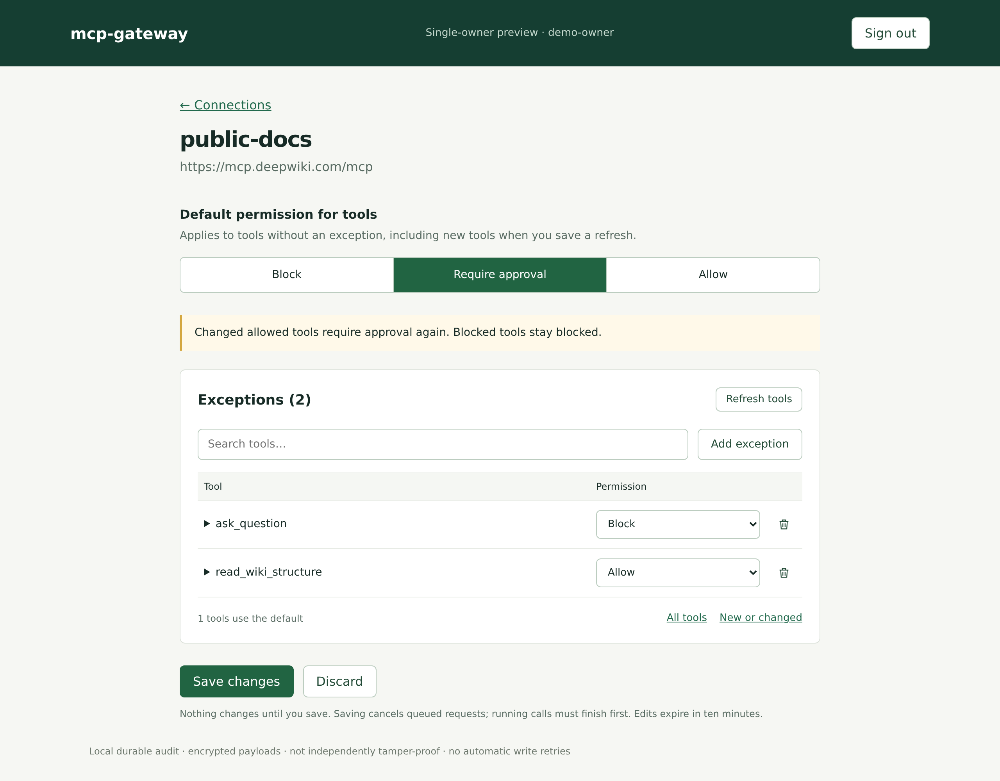

# Amp MCP Gateway

Managing auth for a pile of MCP servers in Amp is a pain. Amp MCP Gateway puts
them behind one connection, keeps their credentials in one place, and lets you
require approval before Amp calls particular tools. It remains compatible with
any client that supports Streamable HTTP MCP.

It's self-hosted, written in Go, and still a prototype. The demo works end to end
with fake services. DeepWiki discovery and Buildkite OAuth/discovery have been
tested; real provider execution still needs validation.

## How it works

The agent gets three execution tools and one policy proposal tool:

- `find_tools` searches the configured tools and returns their argument schemas.
  Queries allow at most 1,024 UTF-8 bytes and 32 distinct case-insensitive terms.
  Empty queries return all permitted tools; repeated terms do not change matches.
- `call_tools` submits a call to a specific tool. It either queues it, denies it,
  or returns a link for human approval.
- `get_operation` checks the status and retrieves the result.
- `propose_policy_changes` prepares an immutable batch for human browser review;
  it cannot apply policies or approve its own proposal.

For example, propose a connection default and explicit tool exceptions:

```json
{
  "changes": [{
    "connection": "notes",
    "default_policy": "require_approval",
    "tools": {"notes.create": "deny"}
  }]
}
```

Use exact saved tool IDs. Omitted defaults and exceptions stay unchanged; policies
are `allow`, `require_approval`, or `deny`. Tool exceptions also accept `inherit`
to remove an exception. No tool-name-based safety classification is performed.
The tool returns one `review_url` and `expires_at` for up to 32 connections.
Only the signed-in owner can apply or discard the entire batch. The review shows
defaults, exceptions, and effective permissions before and after, including
unchanged tools and blocks. Changing a default also affects tools that inherit it.

Proposals expire after ten minutes, are lost on restart, and become invalid after
any catalogue change. Opening ordinary permission pages or creating another
proposal does not replace an existing proposal. At most 32 proposals may be open.
Applying uses the existing atomic catalogue save: queued calls are revoked and
running calls must finish first. Proposal, apply, and discard events are audited;
the apply event commits with the policies. Verified Amp user/thread attribution
comes only from workload authentication; bearer clients have no verified Amp
identity. These links do not authorize access without human browser login.
If prompted to sign in, reopen the review link after signing in.



For example, after finding `notes.create`, the agent calls `call_tools` with:

```json
{
  "request_id": "note-example-001",
  "calls": [
    {
      "tool_id": "notes.create",
      "arguments": {"text": "Release checklist reviewed"}
    }
  ]
}
```

That demo tool requires approval. You review the account and exact arguments in
the browser, then approve or deny. The request and its outcome are saved, so the
agent can check back later without keeping the connection open.

Finished calls show the result first, with JSON formatted for reading. Expand
**Raw MCP response** for the full response, or **Request details** and
**Identity & audit** for the arguments and attribution.



The activity page shows what ran, what was denied, and who approved it.



## Connect an MCP

Sign in to the gateway and click **Add MCP**. Enter the server URL and choose
OAuth, a bearer token, or no authentication for a public server. For OAuth, review
the authorization server and scopes, then sign in with the provider.

Use **Test connection** beside **Reconnect OAuth** to verify access without executing
tools or changing permissions. Health shows the last test, refresh and access-token
expiry. OAuth credentials refresh automatically while idle when the provider issues
a refresh token and expiry; revoked grants and uncertain refresh outcomes still need
attention. See [credential maintenance and recovery](docs/dev.md#connect-a-remote-mcp)
for retry and provider limits.



Click **Refresh tools**, set a connection default—usually **Require approval**—and
**Save changes**. Search finds tools across the connection, including those using
the default. Each result shows its permission; **Default: Require approval**, for
example, means it inherits the connection setting. Select multiple results to
allow or block them together, or reset them to the connection default.
Nothing changes until you save. Refreshes keep unchanged permissions; changed
allowed tools go back to approval and blocked tools stay blocked.



This supports remote Streamable HTTP servers on public HTTPS, not local commands.
See the [connection guide](docs/dev.md#connect-a-remote-mcp) for an example and
provider limitations.

## What's there today

Bearer-token and OAuth connections, token refresh, per-tool rules, browser
approvals, and encrypted storage for OAuth tokens, arguments and results.

A few limits worth knowing:

- One owner and one call per request. Search is keyword-based.
- Amp orbs can authenticate with short-lived identity tokens; requests link back
  to their thread. Browser approvals use a separate OIDC login.
- Google Workspace login can require both your domain and your exact account.
  Validate the configured identity provider before relying on a deployment. The
  local demo uses a shared fixture token.
- Model names are reported by the client, not verified. Account names are labels.
- The audit log is local, not tamper-proof.
- New work pauses at 10,000 retained operations, 50,000 audit events, or 64 MiB
  of operation payload and audit field bytes. At most 16 operations can remain
  pending, ready or running. Existing work can still finish; history is retained.
- A timed-out call may have run upstream. We mark it `unknown` and don't retry it.

## Try it

The [dev guide](docs/dev.md) has setup instructions and runnable examples.
The [plan](docs/plan.md) covers what comes next; the [feature matrix and TODOs](docs/todo.md)
track what's implemented and what's still an idea.
