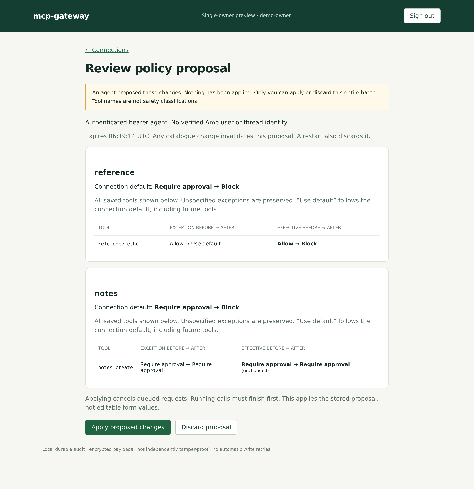
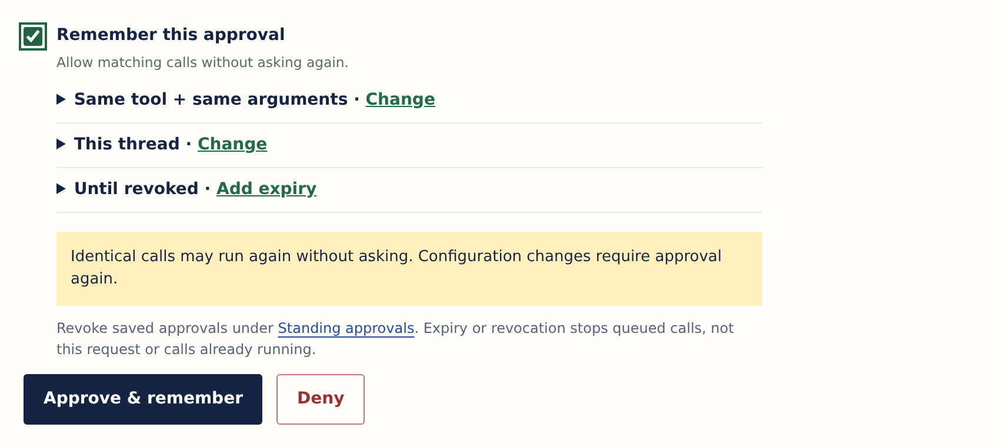
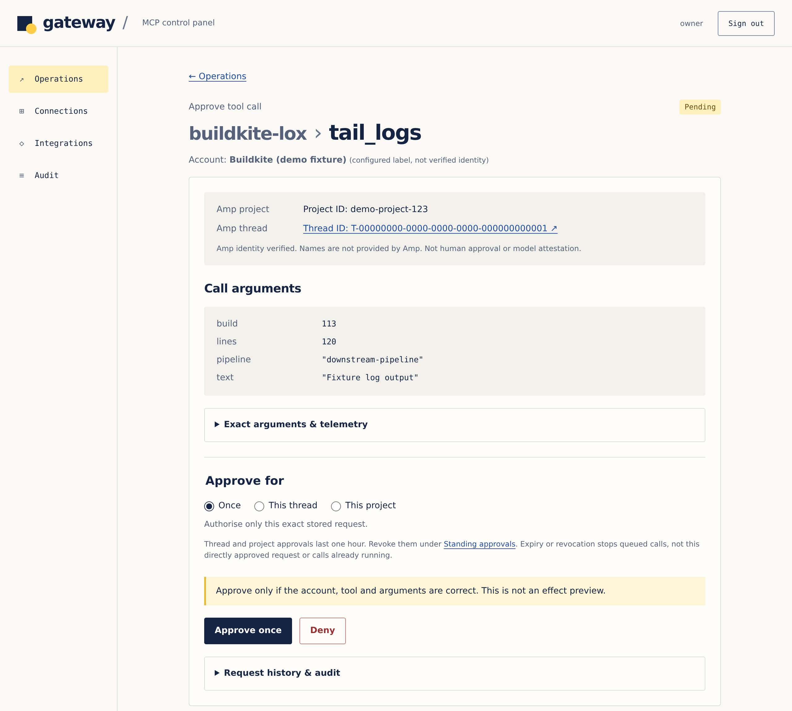
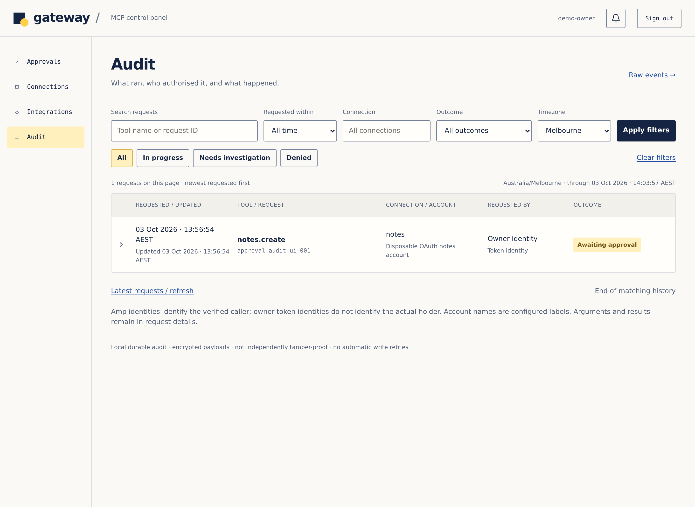
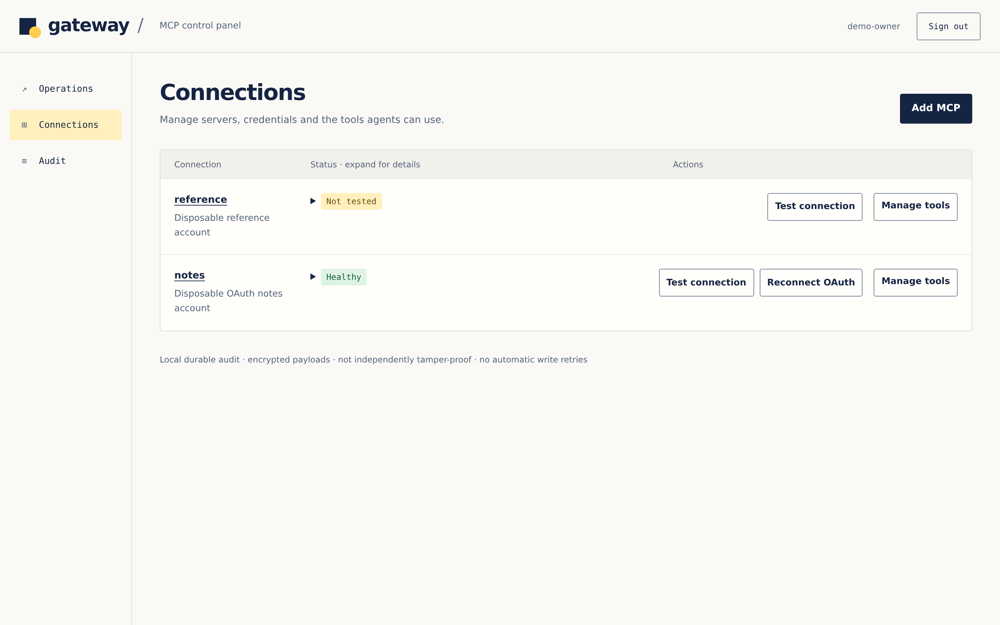
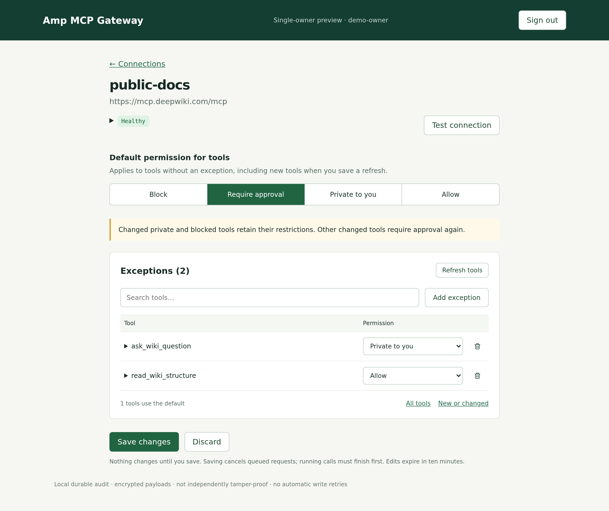

# Amp MCP Gateway

Managing auth for a pile of MCP servers in Amp is a pain. Amp MCP Gateway puts
them behind one connection, keeps their credentials in one place, and lets you
require approval before Amp calls particular tools. It remains compatible with
any client that supports Streamable HTTP MCP.

It's self-hosted, written in Go, and still a prototype. The demo works end to end
with fake services. DeepWiki discovery and Buildkite OAuth/discovery have been
tested; real provider execution still needs validation.

## How it works

The agent gets three execution tools and one policy proposal tool:

- `find_tools` searches the configured tools and returns their argument schemas.
  Queries allow at most 1,024 UTF-8 bytes and 32 distinct case-insensitive terms.
  Empty queries return all permitted tools; repeated terms do not change matches.
- `call_tools` submits a call to a specific tool. It either queues it, denies it,
  or returns a link for human approval.
- `get_operation` checks the status and retrieves the result.
- `propose_policy_changes` prepares an immutable batch for human browser review;
  it cannot apply policies or approve its own proposal.

For example, propose a connection default and explicit tool exceptions:

```json
{
  "changes": [{
    "connection": "notes",
    "private": true,
    "default_policy": "require_approval",
    "tools": {"notes.create": "deny"}
  }]
}
```

Use exact saved tool IDs. Omitted settings stay unchanged; policies are `allow`,
`require_approval`, or `deny`. Tool exceptions also accept `inherit` to remove an
exception. A connection can independently be `private`; all of its tools are then
discoverable and callable only when Amp's fresh per-call token verifies the owner's
thread is private, multiplayer is inactive, and no non-owner can influence it. Its
results are unavailable from shared or multiplayer contexts. This setting requires
Amp Workload Identity and is unavailable with legacy bearer authentication. No
tool-name-based safety classification is performed.
The tool returns one `review_url` and `expires_at` for up to 32 connections.
Only the signed-in owner can apply or discard the entire batch. The review shows
defaults, exceptions, and effective permissions before and after, including
unchanged tools and blocks. Changing a default also affects tools that inherit it.

Proposals expire after ten minutes, are lost on restart, and become invalid after
any catalogue change. Opening ordinary permission pages or creating another
proposal does not replace an existing proposal. At most 32 proposals may be open.
Applying uses the existing atomic catalogue save: queued calls are revoked and
running calls must finish first. Proposal, apply, and discard events are audited;
the apply event commits with the policies. Verified Amp user/thread attribution
comes only from workload authentication; bearer clients have no verified Amp
identity. These links do not authorize access without human browser login.
If prompted to sign in, reopen the review link after signing in.



For example, after finding `notes.create`, the agent calls `call_tools` with:

```json
{
  "request_id": "note-example-001",
  "calls": [
    {
      "tool_id": "notes.create",
      "arguments": {"text": "Release checklist reviewed"}
    }
  ]
}
```

That demo tool requires approval. You review the account and exact arguments in
the browser, then approve once or deny. Requests with a verified Amp thread identity
also offer **Remember this approval**. A saved approval can match the exact call,
the tool with any arguments, or every non-blocked tool on the connection; it can be
limited to the thread or, when verified, its project. It lasts until revoked unless
you choose the one-hour or 24-hour preset. Manage saved approvals under
**Approvals → Standing approvals**. Expiry or revocation stops queued
grant-authorized calls, not directly approved or already running calls. The request
and its outcome are saved, so the agent can check back later without keeping the
connection open.

Remembering defaults to the same tool and exact arguments, in this thread, until
revoked. Object key order does not affect matching; JSON number spellings must
match exactly. Saved permissions remain bound to the verified owner and connection
configuration, and never override blocked tools. Catalogue or credential changes
can require fresh approval. Existing one-hour approvals keep their original expiry.



Finished calls show the result first, with JSON formatted for reading. Expand
**Raw MCP response** for the full response, or **Request details** and
**Identity & audit** for the arguments and attribution.



**Approvals** opens to **Needs approval** and also manages **Standing approvals**.
Each request includes its history and, after a decision, a link to the next pending
request. **Audit** contains all requests and outcomes, with expandable timelines
and filters for tool name or request ID, connection, outcome and time range. **In
progress** finds queued or running requests regardless of age; **Needs
investigation** finds failed or unconfirmed outcomes. Browse older requests in
pages of 25, or open **Raw events** for the latest 200 ledger events, including
configuration changes. Arguments and results stay in request details.

Approvals and Audit update through an owner-authenticated SSE connection. The
server checks the committed audit sequence every 250 ms and sends a payload-free
notification when it changes; htmx then fetches the current HTML. Active execution
pages stop listening when the call finishes unless desktop alerts are enabled.
Hidden tabs disconnect and refresh on return unless desktop alerts are enabled.
Visible updates wait while text is selected or a list link is focused/hovered,
then resume without needing another ledger event. Unchanged lists are not swapped.

Open the **Approval notifications** bell beside **Sign out**, choose **Enable
notifications**, and allow Chrome's permission prompt to receive desktop alerts
for pending tool-call approvals. Any signed-in gateway
page can stay open in the background; it reuses the SSE connection and fetches an
authenticated, ID-only approval fragment. Alerts contain no tool names, account
details or arguments. Clicking opens the review page; it never approves a request.
Each refresh checks the 100 most recent pending requests, including existing ones
when enabling alerts. The preference and the last 1,000 notified request IDs are
stored in this browser, with cross-tab
deduplication. **Disable notifications** turns alerts off across gateway tabs.
HTTPS, browser site storage and a desktop browser supporting Notifications and Web
Locks are required. Closed, discarded or suspended tabs cannot deliver alerts;
browser or OS settings can also suppress them. This is not Web Push.

SSE streams send keepalives and end after a minute; reconnecting rechecks
authentication. Every HTML request also checks the session. Reconnecting refreshes
current state, so missed notifications need no replay. Reverse proxies must allow
streaming `/events` responses without buffering (the response sets
`X-Accel-Buffering: no`). This is an indexed SQLite check per listening tab,
including background tabs with alerts enabled, not an in-memory event bus or a
change to durable dispatch.

Connection tests update diagnostics in place. These enhancements use locally
served htmx 2.0.8
(vendored from `https://unpkg.com/htmx.org@2.0.8/dist/htmx.min.js`, BSD-0-Clause).
Native forms and page refresh still work without JavaScript. Approval, OAuth and
Chrome pairing remain full-page flows; live updates never resubmit those actions.
No page content is stored in htmx's browser history cache.



## Review a call inside Amp

The project plugin in [`.amp/plugins/gateway-review.ts`](.amp/plugins/gateway-review.ts)
adds `gateway_review_operation`: a minimal **Approval required: tool name** card
with a native **Open approval page** link button, **Cancel**, and **Approved**.
The link opens the gateway in your browser and leaves the card open. Review the
arguments there, then return and click **Approved** to check the result—not to
grant approval. Reload plugins in Amp after updating. For personal use
outside this project, publish the same file as `gateway-review.ts` in your personal
plugins repository. A project copy takes precedence over a personal copy with the
same name; keep them in sync when publishing updates.

Amp supplies `operation_id` and the exact `status` from the latest `call_tools` or
`get_operation` response. Only `pending` shows the card and requires `tool` and
`approval_url`; all other statuses skip it, including calls already authorized by
a project grant. The plugin does not fetch or independently verify this supplied
status. There is no local approval cache. No arguments or account fields are shown.
This version pins links to `https://lox-mcp-gateway.fly.dev`; change
`gatewayOrigin` and the test URLs together for another deployment. It does not
support local demo or portal URLs unchanged.

The plugin holds no credentials and cannot submit, approve, deny or poll operations.
Cancel dismisses the preview without changing the request. After you continue,
Amp uses the existing MCP `get_operation` tool with the same ID, up to 60 times at
five-second intervals. A timeout is not success; an unknown outcome must not be
automatically retried.

The native button requires Amp's `PluginConfirmField` support for `type: 'link'`
([plugin guide](https://ampcode.com/docs/customize/plugins?ui=web)). It does not use
`system.open()`, which targets the machine running the plugin. Older Amp versions
that support only text and image fields need updating. Continuing is not proof of
approval: Amp must read the gateway's status. End-to-end browser approval remains
unverified.

Run `mise run check-plugin` for the plugin tests (also run in Buildkite).

## Connect an MCP

Sign in to the gateway and open **Connections → Add MCP**. Enter the server URL and choose
OAuth, a bearer token, or no authentication for a public server. For OAuth, review
the authorization server and scopes, then sign in with the provider.

Use **Test connection** beside **Reconnect OAuth** to verify access without executing
tools or changing permissions. Health shows the last test, refresh and access-token
expiry. OAuth credentials refresh automatically while idle when the provider issues
a refresh token and expiry; revoked grants and uncertain refresh outcomes still need
attention. See [credential maintenance and recovery](docs/dev.md#connect-a-remote-mcp)
for retry and provider limits.



Open a connection's **Tools & permissions** page, click **Refresh tools**, set a connection default—usually **Require approval**—and
**Save changes**. Search finds tools across the connection, including those using
the default. Each result shows its permission; **Default: Require approval**, for
example, means it inherits the connection setting. Select multiple results to
allow or block them together, or reset them to the connection default. Mark the
connection private to restrict every tool independently of those permissions.
Nothing changes until you save. Refreshes keep unchanged permissions; changed
blocked tools remain blocked, while other changed tools go back to approval.

The connection's **Settings** page shows its endpoint, account label and OAuth settings.



This supports remote Streamable HTTP servers on public HTTPS, not local commands.
See the [connection guide](docs/dev.md#connect-a-remote-mcp) for an example and
provider limitations.

## Connect a native integration

**Integrations** are native providers whose capabilities use the same discovery,
policy, approval and audit path as remote MCP tools. The first prototype is Fly.io.
Store one scoped Fly access token and the gateway exposes `fly.request_token`.
An approved call returns a caller-bound, single-use redemption URL—not a credential.
Redeeming that URL derives a Fly token that retains every parent restriction and
expires after at most 15 minutes.

This supports ordinary `flyctl` work that must run inside the calling orb, including
commands that need its source tree. The gateway records the request, approval and
redemption, but cannot observe individual Fly calls after issuing the short-lived
token. See the [Fly integration guide](docs/dev.md#flyio-integration) for setup and
the safe shell pattern.

## What's there today

Bearer-token and OAuth connections, token refresh, per-tool rules, browser
approvals, a reverse-connected Chrome extension for one selected tab, encrypted
storage for credentials, arguments and results, and a Fly.io short-lived
credential integration prototype.

A few limits worth knowing:

- One owner and one call per request. Search is keyword-based.
- Amp remote MCP definitions can authenticate with Amp Workload Identity; requests
  retain their verified workspace, project and thread context. Browser approvals
  use a separate OIDC login.
- Google Workspace login can require both your domain and your exact account.
  Validate the configured identity provider before relying on a deployment. The
  local demo uses a shared fixture token.
- Model names are reported by the client, not verified. Account names are labels.
- The audit log is local, not tamper-proof.
- New work pauses at 10,000 retained operations, 50,000 audit events, or 64 MiB
  of operation payload and audit field bytes. At most 16 operations can remain
  pending, ready or running. Existing work can still finish; history is retained.
- A timed-out call may have run upstream. We mark it `unknown` and don't retry it.

## Try it

The [dev guide](docs/dev.md) has setup instructions and runnable examples.
The [plan](docs/plan.md) covers what comes next; the [feature matrix and TODOs](docs/todo.md)
track what's implemented and what's still an idea.

To share a normal Chrome tab with an orb, load the unpacked extension from
`extension/`, save the gateway origin in the extension's **Settings**, then pair it
from **Integrations → Chrome** in the gateway dashboard,
and use the configured `browser.*` tools through `find_tools` and `call_tools`. See the
[Chrome extension guide](docs/dev.md#share-a-chrome-tab).
