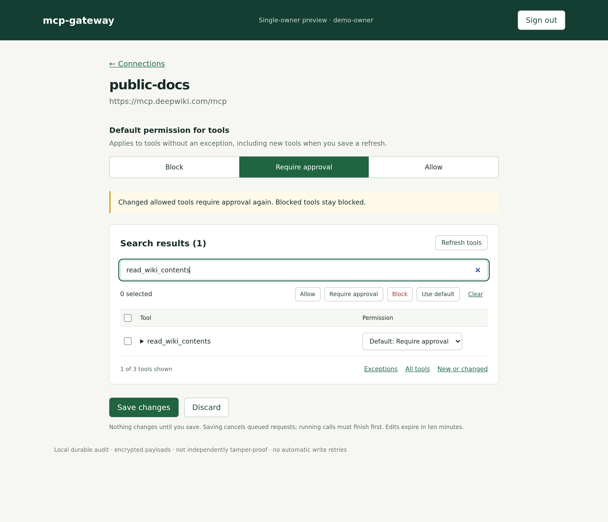

# Development

The gateway uses Go, the official MCP Go SDK, server-rendered HTML and SQLite.
There is no frontend build. Run one process against one persistent disk; the file
lock prevents competing workers.

This is a single-owner prototype. Tests use fake services, not real accounts.
See the [plan](plan.md) and [feature matrix](todo.md) for what's still missing.

## Run the demo

Prerequisites: Linux or macOS, Git and curl. Setup installs mise if absent and the
pinned Go toolchain. Run commands from the repository root.

Clone the repository with `gh repo clone lox/amp-mcp-gateway` and enter the
checkout. Then:

```sh
.agents/setup
export PATH="$HOME/.local/bin:$PATH"
mise run check
mise run dev
```

On your machine, open `http://localhost:8080`. Sign in with **demo-only** and click
**Connect / reconnect OAuth** before submitting a notes request. The fake provider
authorizes immediately. Nothing connects to a real account.

The two loopback fixtures on port 8091 are `reference.echo` (allowed) and
`notes.create` (approval required). Both return the supplied text; the notes fixture
does not maintain a separate notes database. Demo keys are generated once in
`.local/demo-secrets.json`, mode 0600, and never printed by the helper client.

From another terminal:

```sh
# Discover tools and their argument schemas.
mise exec -- go run ./cmd/demo-client -args '{"query":"notes"}'

# An allowed read goes directly into the execution queue.
mise exec -- go run ./cmd/demo-client -tool call_tools -args \
  '{"request_id":"read-example-001","calls":[{"tool_id":"reference.echo","arguments":{"text":"Hello gateway"}}]}'

# A write waits for a human. The model label is unverified client metadata.
mise exec -- go run ./cmd/demo-client -tool call_tools -args \
  '{"request_id":"note-example-001","model_reported":"example-model","calls":[{"tool_id":"notes.create","arguments":{"text":"Release checklist reviewed"}}]}'

# Open the returned approval_url, review the exact arguments, and approve or deny.
mise exec -- go run ./cmd/demo-client -tool get_operation -args \
  '{"id":"note-example-001"}'
```

Reuse a `request_id` only for the exact same request. Poll `get_operation` for the
result. Do not generate a fresh ID to retry an ambiguous write.

For a new write, the `structuredContent` field of the MCP response looks like:

```json
{
  "id": "note-example-001",
  "status": "pending",
  "approval_url": "http://localhost:8080/operations/note-example-001"
}
```

After approval, poll the same ID until it reaches `succeeded`, `failed`, `denied`,
`expired` or `unknown`. A successful result includes the upstream MCP response in
`result`; the demo's `result.structuredContent` contains the original text and
`"fixture": true`. `ready` and `running` are intermediate states. If you repeat
these examples, use new IDs only for deliberately new operations.

For another MCP client, configure a Streamable HTTP connection to `/mcp` with an
`Authorization: Bearer <gateway-token>` header. In demo mode the token is the
`GatewayToken` field in the private local secrets file. Use your client's secret
storage; do not commit it or paste it into a chat. The demo helper reads it directly.
The helper refuses HTTP redirects so credentials stay at the chosen endpoint; pass
the final MCP URL when overriding `-url`.

## Share a Chrome tab

The demo and example configuration include a reverse-connected `browser`
connection. It lets an orb inspect and control one explicitly selected tab in a
normal Chrome profile without exposing a listener on your machine.

1. In Chrome 116 or newer, open `chrome://extensions`, enable **Developer mode**,
   choose **Load unpacked**, and select this checkout's `extension` directory.
2. Sign in to the gateway dashboard and click **Pair extension** on the browser
   connection. Create a pairing code.
3. Open the tab you want to share, open the extension, and paste the displayed
   gateway URL and pairing code.
4. Find `browser` tools through MCP. `browser.snapshot` returns a `document_id` and
   accessibility-tree `backend_node_id` values. Pass both to `browser.click` and
   `browser.type`; navigation invalidates the document ID and requires a new snapshot.

The available tools are `browser.snapshot`, `browser.screenshot`, `browser.scroll`,
`browser.click`, `browser.type`, and `browser.navigate`. The example policies allow
viewing and scrolling directly while requiring approval for click, type, and
navigate. The extension uses Chrome's debugger API only for the selected HTTP(S)
tab; Chrome pages, the Web Store, browser dialogs, files outside browser-mediated
uploads, and the desktop remain inaccessible.

The extension opens an authenticated WebSocket to `/browser/connect`; orbs still
connect to `/mcp`. Pairing credentials live only in gateway memory and Chrome
session storage, so restarting either side requires pairing again. The displayed
one-time code is consumed on first use and exchanged for a reconnect credential
bound to that extension install, share generation, and tab. Re-pairing, revocation,
or selecting a new share generation invalidates queued approvals.
Once a browser mutation is dispatched, a disconnect or extension-reported error
marks its outcome unknown and is never replayed automatically.
Deploy the gateway at a stable private HTTPS origin reachable by Chrome and the
orbs before using the extension outside the local demo.

## Connect a remote MCP

After signing in, click **Add MCP**. As a public read-only example:

- Connection name: `public-docs`
- MCP server URL: `https://mcp.deepwiki.com/mcp`
- Authentication: **None — public server**

Add the server and click **Refresh tools**. For this example set the connection
default to **Block**, choose **All tools**, and set `read_wiki_structure` to
**Allow**. Other tools inherit Block. Save, then check discovery:

```sh
mise exec -- go run ./cmd/demo-client -args '{"query":"public-docs"}'
```

For private providers, choose **Bearer token** or **OAuth**. OAuth discovers the
provider's metadata and tries dynamic client registration. If registration is
unavailable, expand **Use an existing OAuth client** and supply its client ID and,
if required, secret. Register the callback shown in the form with that provider.
Review the discovered authorization server and scopes before clicking
**Connect OAuth** (or **Reconnect OAuth**). **Test connection**, beside reconnect,
initializes MCP and lists tools without executing a tool or changing permissions.
It updates health inline, preserving unsaved tool edits. **Healthy** means that
test or a tool-list fetch succeeded at the displayed time, not continuous monitoring
or verified account identity. Test observations reset to **Not tested** on restart
or reauthorization. Viewing status does not contact the provider.

Use the Connect/Reconnect button to start authorization: initiation requires an
owner-authenticated, same-origin POST. Direct GET links do not start a grant.
The response opens the provider in a new navigation, preserving the gateway's
`form-action 'self'` policy; a Continue link is available if JavaScript is disabled.

The gateway checks OAuth grants every minute, refreshing tokens within two minutes
of expiry even while idle. Expired tokens also refresh on use. Credentials, rotated
refresh tokens, last-refresh times and refresh outcomes are encrypted and survive
restarts. No expiry means no proactive schedule; no refresh token means reconnect
will be needed when access expires. Provider revocation and absolute grant lifetimes
still require consent again. The gateway must remain running to maintain idle grants.

Connection health distinguishes **Refresh delayed** (a retry after one or two minutes),
**Refresh paused** (three attempts exhausted; test to resume), **Reconnect required**
(expired without refresh or `invalid_grant`), **Refresh blocked** (OAuth client/request
configuration), and **Status unavailable** (storage failure). Only connection failures
before a socket is acquired and explicit OAuth `server_error`/`temporarily_unavailable`
rejections are retried. Lost or malformed responses, interrupted refreshes, and failed
rotation persistence show **Refresh uncertain** and are never replayed, even on restart
or when testing. Reconnect to recover those grants safely. A bare HTTP 5xx response is
ambiguous, not proof that a rotating refresh token was unused.

New grants retain the successful exchange's client authentication method. Legacy
grants use configured `AuthStyle`, or the OAuth default (Basic for confidential
clients, form parameters for public clients). An explicit HTTP 400/401
`invalid_client` permits one scheduled switch from legacy Basic to form authentication;
ambiguous failures never trigger authentication-method probing.
PKCE S256 is required. Providers requiring client-ID
metadata documents or custom authentication flows are not supported yet.
Discovered authorization and token endpoints must share an origin, except for
Google and Dropbox's exact published pairs, discovered from their respective issuers:

- Google: `https://accounts.google.com/o/oauth2/v2/auth` and `https://oauth2.googleapis.com/token`.
- Dropbox: `https://www.dropbox.com/oauth2/authorize` and `https://api.dropboxapi.com/oauth2/token`.

Other split-origin providers are rejected. Dynamic registration responses with
expiring client secrets are also rejected; registration renewal is not implemented.

Only public HTTPS port 443 is accepted through the browser. Private-network
addresses, redirects and proxies are blocked; DNS is checked at connection time.
Local stdio and legacy SSE servers are not supported by this flow. Static trusted
configuration can still use loopback fixtures. Discovery is limited to 500 tools,
2 MiB of tool definitions plus pagination cursors and a 30-second timeout. Schemas
must be self-contained.

### Google Sheets, Drive and Gmail

Google requires an existing **Web application** OAuth client ID and secret;
it does not support dynamic client registration. You can reuse the client used
by another MCP client, keeping its existing redirect URIs. Add a gateway callback
for each connection name (replace the hostname for another deployment):

```text
https://gateway.example.com/connections/google-sheets/callback
https://gateway.example.com/connections/google-drive/callback
https://gateway.example.com/connections/google-gmail/callback
```

In **Add MCP**, select OAuth and expand **Use an existing OAuth client**. Enter
the ID and secret in the gateway, not in chat or source control. Use these names
and endpoints:

| Connection name | MCP URL |
| --- | --- |
| `google-sheets` | `https://sheetsmcp.googleapis.com/mcp/v1` |
| `google-drive` | `https://drivemcp.googleapis.com/mcp/v1` |
| `google-gmail` | `https://gmailmcp.googleapis.com/mcp/v1` |

The gateway requests the scopes advertised by the provider; these can include
write access. Review them before connecting. Google authorization requests offline
access and consent so the gateway can receive a refresh token, including when
the OAuth client already has a grant. The Google account, consent-screen audience
and enabled APIs must permit the connection. See Google's
[Workspace MCP setup guide](https://developers.google.com/workspace/guides/configure-mcp-servers).

Fetch tools, keep **Require approval** as the default, and save. Test a harmless
read and browser approval/denial before disabling the original direct connection.
For Sheets, use a disposable spreadsheet. Verify refresh/reconnect before relying
on the gateway as the only route. Successful discovery alone does not prove that
Google granted access or that a tool call will succeed.

### Dropbox

In **Add MCP**, use connection name `dropbox`, URL `https://mcp.dropbox.com/mcp`
and **OAuth**. Dropbox advertises dynamic client registration but restricts it to
[approved clients](https://help.dropbox.com/integrations/connect-dropbox-mcp-server).
For this gateway, register a Dropbox app and use its app key and secret under
**Use an existing OAuth client**, with this callback:

```text
https://gateway.example.com/connections/dropbox/callback
```

Review the advertised scopes before connecting; they include write access.
The gateway requests `token_access_type=offline` so Dropbox can issue a refresh
token. Fetch tools, keep **Require approval** as the default, and explicitly allow
only the reads you want. Verify a harmless read, approval/denial and token refresh
before removing the direct connection. Discovery support does not establish that
registration, consent or real calls have succeeded.

### Defaults, exceptions and refreshes

The suggested connection default is **Require approval**. The page starts with
**Exceptions**. **Add exception** opens the full tool list; choose a permission
for any tool you want to override. Searching from any view searches all tools in
the connection. Clearing the query restores that view. Inherited permissions show
**Default: Require approval**, **Default: Allow** or **Default: Block**, reflecting
the current draft default. Explicit exceptions keep their own permission.
Select visible tools and click a bulk permission button. Edits are staged until
**Save changes**. Filtering clears hidden selections. The remove button or the
**Default: …** option removes an exception; **Use default** does the same in bulk.
Expand a tool to read its description and schema; names and read-only annotations
never grant permissions.



Existing saved permissions are preserved as explicit exceptions on upgrade.
To adopt the default for them, select them in bulk and choose **Use default**
once. Changing a connection default never overrides explicit choices.
You can edit saved permissions without fetching the server, including when it is
offline. **Allow** as the default also allows new tools without approval after
you save a refresh; the form warns about this explicitly.

Fetching alone changes no live policies. Refresh keeps the default and exceptions
you are editing, including if the fetch fails; changed definitions still trigger
the approval/block rules below. You must save to publish these choices.
The preview marks new and changed tools
and lists removals. New tools inherit the default. Unchanged schemas/descriptions
keep their exceptions; changed tools require approval unless previously blocked,
in which case they remain blocked. This also applies to tools previously allowed
through the default. Removed tools disappear on save; historical operations remain.
Save publishes the reviewed snapshot, replacing that connection's tool list.
Edits expire after ten minutes and reject stale saves. Reopening saved permissions
replaces any earlier saved-permissions edit for that connection, including in
another tab; fetched-tool reviews remain independent. There is no background
refresh or drift detection; upstream behavior can still change between calls.
Editing endpoints, rotating pasted tokens, and removing connections in the UI
are follow-up work.

### Saved configuration and rollout

The first browser save copies the current connections and tools into encrypted
SQLite storage. After that, the saved catalogue replaces `Connections`, `Tools`
and `ToolDefaults` from the startup JSON, including after a deploy or restart.
Identity, listen and
deployment settings still come from the file/environment. Editing those JSON
fields will no longer change the running catalogue. Defaults are stored separately
from upstream credentials, so changing them does not discard OAuth grants.
An empty tool `Policy` means inherit; explicit policies remain exceptions.
Protect and back up the database **and its encryption key**; this includes pasted bearer tokens and OAuth
client secrets as well as grants.

Adding a connection or saving policies atomically denies **all** pending/ready
operations, recording `catalogue-changed` transitions. Running operations block
the save until they finish. There is not yet a separate audit record for each
configuration edit. Startup adds an empty `catalogue` table to existing databases;
existing grants and pinned tools remain unchanged until a browser save. Rolling
back to an older binary ignores the saved catalogue and uses file configuration,
so do not treat a binary rollback as a safe policy rollback. The previous
browser-onboarding binary rejects inherited (empty) policies at startup; after
adopting defaults, roll forward rather than rolling back to that binary.

### Amp orbs

`.agents/setup` installs and builds the project. `.amp/services.yaml` declares the
supervised demo; `.agents/demo` passes its assigned port and public origin.

```sh
amp orb services ensure
```

Open the portal URL printed by that command. It uses the same demo-only password.
Use the helper client inside the orb; ordinary remote MCP clients cannot bypass
Amp's portal authentication using the gateway bearer token alone.

#### Real-account debugging through a private portal

`mcp-gateway -orb-portal-auth -config <isolated-config>` uses Amp's portal identity
instead of Google browser login. This is an explicit development option, not a
production authentication alternative. It requires:

- `AMP_ORB=1` and `BaseURL` matching the service's `PUBLIC_URL` with its trailing
  slash removed. This keeps the MCP workload-token audience equal to the origin.
- A literal loopback `Listen`, such as `127.0.0.1:<PORT>`.
- Your exact `AmpUserID` and `OwnerSubject: "amp-portal:<AmpUserID>"`.
- Empty `Issuer`, `ClientID` and `HostedDomain`; no `-demo` flag.
- A separate database and fresh encryption/session keys, never production data.

Keep the portal private. The app requires `X-Amp-Authenticated: amp-user=yes`
and an exact `X-Amp-User-ID` match on every browser request, from the loopback
proxy and for the configured host. Missing identity returns 403; cookies cannot
bypass it. Google callback/login is not used, and logout directs you to sign out
of Amp. Browser actions are attributed to `amp-portal:<AmpUserID>`.

This relies on [Amp's portal identity headers](https://ampcode.com/docs/orbs/portals).
They are not signed: all processes and agents inside the owning orb are trusted.
Never expose the backend or place an untrusted proxy in front of it. Environment
guards prevent accidental activation, not a malicious operator from changing
the environment. Orb-internal portal requests bypass external Amp login and may
not have identity headers; test those headers locally only as a trusted-proxy
fixture, not as proof of external sign-in.

MCP workload authentication, browser CSRF protection and upstream OAuth stay
enabled. Register each upstream callback against the portal origin (for Dropbox,
`/connections/dropbox/callback`). No Google browser callback is needed in this mode.

### Fly: Amp clients and Google browser login

A Fly deployment needs Google credentials, exact owner restrictions and a public
HTTPS origin. `fly.toml` uses one Machine in Sydney and `/data/gateway.db` on a
persistent volume. It does not run demo mode or fake providers. Before relying on
a deployment, verify health, authenticated Amp discovery, unauthenticated rejection
and a complete browser login against its configured identity provider.

Hosted-domain login requests `openid email`, as required by Google's OIDC flow;
authorization still uses the verified subject and `hd` claim, not the email address.
If the browser reports `authentication failed`, check Fly logs for
`browser authentication failed` and its `reason`: `token_exchange`,
`missing_id_token`, `id_token_verification`, `nonce`, `owner` or `hosted_domain`.
These logs contain fixed stage names, not tokens, provider responses or user claims.
Start a fresh login after a failure; callback state is single-use.
The gateway retains at most 128 pending browser logins, with at most eight per
IPv4 address or IPv6 /64. Excess attempts from one source receive HTTP 429; the
global limit returns HTTP 503. Expired or consumed states release capacity.
A browser retry with a valid signed state cookie reuses its live login without
extending its expiry, including when either limit is full. Existing callbacks
remain valid. Distributed traffic can still exhaust the global pool, so ingress
request-rate controls remain useful.

Direct deployments use the TCP peer address and ignore forwarding headers. On
Fly (`FLY_APP_NAME` set), login admission uses the proxy's
[`Fly-Client-IP` header](https://fly.io/docs/networking/request-headers/).
Other trusted ingress deployments can set `-trusted-client-ip-header HEADER`.
Only enable this when the ingress overwrites the header and clients cannot reach
the listener directly. Missing, malformed or repeated header values reject login
with HTTP 400. Another proxy in front of Fly needs its own admission controls;
otherwise its users share Fly's source limit.

To configure a deployment:

1. Register a dedicated Google OAuth **Web application** client in your Workspace
   organisation. Use an internal consent screen where available and the exact
   redirect URI `https://gateway.example.com/auth/callback`, replacing the host.
2. Copy `gateway.fly.example.json` to ignored `gateway.json`. Set the client ID and
   your stable Google `sub`, obtained from a verified Google sign-in. Keep
   `HostedDomain` set to your Workspace domain. Both domain and exact owner must
   match; an email suffix or the `hd` login hint is not authorization. There is no
   first-login takeover.
3. Confirm `AmpUserID` is your immutable Amp ID. All orb threads created by that
   user share the configured owner's tool authority and can read its operations.
   Project restrictions and per-thread permissions are not implemented.
4. Supply `GATEWAY_OIDC_SECRET`, `GATEWAY_ENCRYPTION_KEY` and `GATEWAY_SESSION_KEY`
   through Fly secrets. Generate the latter two independently as 32 random bytes,
   standard base64. Back up the encryption key separately from the database.
   Never put credentials in source, command arguments, logs or chat.

Import configuration without printing it or putting it into process arguments:

```sh
export FLY_APP=your-app-name
{ printf 'GATEWAY_CONFIG='; base64 < gateway.json | tr -d '\n'; printf '\n'; } |
  fly secrets import --stage --app "$FLY_APP"
```

Use `fly secrets import --stage` with protected stdin for the three secret values
too. `GATEWAY_CONFIG` is decoded by Fly into `/etc/gateway.json`; the encryption
and session keys remain environment secrets, not files on the database volume.
Do not set `GATEWAY_TOKEN`: setting `AmpUserID` disables shared-token MCP access.

Once configuration is complete, create the volume and public addresses once:

```sh
fly volumes create gateway_data --region syd --size 1 --app "$FLY_APP"
fly ips allocate-v6 --app "$FLY_APP"
fly ips allocate-v4 --shared --app "$FLY_APP"
fly config validate
fly deploy --app "$FLY_APP" --remote-only --ha=false
fly checks list
```

Subsequent deployments only need the final three commands. The default rolling
strategy updates the single Machine in place and waits for health checks. Do not
add replicas or use blue-green deployment with this SQLite setup. The Machine
stays running and incurs charges, as does the volume. Buildkite deploys merges to
`main` once its deployment secret is configured, as described below.
To suspend use, disable proxy auto-start before stopping the Machine; otherwise a
request can start it again. Snapshots do not replace a tested backup/restore process.

### Buildkite CI and deployment

The Buildkite pipeline uses a hosted cluster's `default` queue. The GitHub webhook
builds branches and pull requests; fork PRs are disabled. The pipeline uploads
`.buildkite/pipeline.yml` from the checkout.

Checks use the `setup-go` plugin to install the Go version from `mise.toml`, then
run formatting checks, race tests, vet and build the gateway. A hosted
cache volume retains the mise toolchains and Go module/build caches; cache misses
fall back to normal downloads and compilation. The deploy job installs only
`flyctl` with the mise plugin, without rebuilding Go binaries locally; Fly's remote
Docker builder still builds the production image from source.

Fly config validation runs in the authenticated deploy job. Only non-PR `main`
builds deploy after checks pass. Deploys
share one concurrency slot, skip superseded main commits, use Fly's rolling
strategy without HA, and check public `/healthz` afterwards. Running deployments
are not automatically cancelled by a newer commit.

**One-time credential setup:** create an app-scoped Fly deploy token on your trusted
machine, not an organisation-wide token:

```sh
fly tokens create deploy --app "$FLY_APP" --name buildkite --expiry 2160h
```

Store it as the Buildkite secret **`MCP_GATEWAY_FLY_DEPLOY`** in the **Hosted**
cluster. Restrict its agent access to the deployment pipeline with:

```yaml
- pipeline_id: "YOUR_BUILDKITE_PIPELINE_ID"
  build_branch: "main"
  build_source: "webhook"
```

The deploy script retrieves it only after its branch and freshness checks. Keep
the Google and encryption secrets in Fly, not Buildkite. The deploy token expires
after 90 days; replace it before expiry and revoke the old token. The secret is
configured and automatic deployment has passed. The policy deliberately rejects
API/manual builds; use a reviewed main push for normal deployment. Pipeline and
repository administrators remain trusted to change production code.

### Connect Amp

[Amp Workload Identity](https://ampcode.com/docs/customize/mcp#amp-workload-identity)
must be enabled for both the person configuring the server and each thread owner
using it. Add the deployed gateway as an Amp-hosted remote MCP definition, not a
local `amp.mcpServers` or skill entry:

```sh
amp mcp remote add Gateway https://gateway.example.com/mcp \
  --auth workload-identity --workspace YOUR-WORKSPACE
```

You can instead select **Amp Workload Identity** in Amp's remote MCP server settings.
Amp sends a fresh five-minute token on requests, using the normalized gateway origin
as the audience, and rejects redirects. No gateway credential or OAuth sign-in is
stored in Amp. This authentication mode does not apply to local MCP configuration.
The local demo still uses `demo-client` and its disposable bearer token.

The gateway verifies Amp's fixed issuer and signature, exact audience, expiry,
`token_use=mcp`, owner user ID and a thread ID. Stored operations include
the verified Amp user and thread link; the Google subject identifies the separate
human approval. Model labels remain unverified. All threads owned by the configured
Amp user are authorized; the gateway does not currently narrow access by workspace
or project. A valid Amp signature alone is not authorization.

## What approval actually guarantees

The gateway persists intent before returning an operation ID. Approval changes only
the status, never the stored arguments. The worker claims that request atomically
before contacting the upstream, then records its outcome and audit event together.

- Approval expires ten minutes after submission, including time spent queued.
- Repeated or concurrent approvals cannot dispatch the same operation twice.
- Changes to the pinned tool, policy, connection, owner, issuer or static upstream
  credential invalidate queued requests when checked at execution.
- Reconnecting OAuth denies **all** pending/ready requests conservatively. It is
  refused while any request is running. Submit new requests after reconnecting.
- OAuth grants are bound to the connection configuration; changed endpoints require
  reconnecting rather than receiving an existing credential.
- Timeouts and transport errors become `unknown`; a restart also marks previously
  running operations `unknown`. No automatic dispatch retries occur.
- `unknown` does not mean failure. Inspect the upstream before deciding what to do.
  There is no exactly-once guarantee across the upstream/network boundary.

New upstream execution errors include a `diagnostic` object in the stored result
and `get_operation` response. It records the stage (`credentials`, `connect` or
`request`), a fixed error category, and HTTP/JSON-RPC error codes when available.
The HTTP code is the last observed non-success response during that stage, not
proof of which request failed. On HTTP 400/401/403, an optional `diagnostic.http`
adds a fixed `reason` and troubleshooting `hint` for recognized authentication
errors: `authentication_rejected`, `invalid_token`, or `insufficient_scope`.
For example, Dropbox's authentication-provider rejection suggests checking the
app permissions and reconnecting OAuth. This is guidance, not a definitive cause.

Only complete error bodies up to 4 KiB with `text/plain` or `application/json`
content types are classified. Arbitrary messages, JSON error descriptions,
HTML and oversized bodies are never copied into diagnostics. The response is
replayed unchanged to the MCP SDK. OAuth token exchanges are not inspected.
Dropbox HTTP errors may also include `diagnostic.http.request_id`: only the
32-character lowercase hexadecimal `X-Dropbox-Request-Id` from
`mcp.dropbox.com` is accepted. Other headers, URLs and arguments are excluded.
Diagnostics use the operation's existing encrypted storage; there is no raw-body
capture or new log stream. Unrecognized errors retain the existing status/code
diagnostic. These details do not authorize retries or change the
`unknown` status. Older records and restart-recovered operations may have no
diagnostic; it cannot be reconstructed after the fact.

The browser shows the tool, configured upstream account label, exact arguments,
request digest and model label. It is **not** an effect preview or a guarantee that
an upstream's implementation has not changed.

The UI pretty-prints schemas, arguments and JSON results only when the added
whitespace stays within twice the compact input size plus 4 KiB. Deeper or larger
expansions use complete compact JSON instead; approval arguments and stored
results are never truncated or changed by presentation.

## Identity and audit boundaries

With Amp authentication, “on behalf of” maps the verified Amp user to the configured
Google owner. The signed thread ID supplies an audit link, not a delegation chain
or proof of human consent. Other threads belonging to that Amp user share access.
Legacy bearer mode identifies only the configured owner, not the actual holder.
Browser approvals check the owner's OIDC issuer/subject, audience, signature,
expiry, nonce and configured hosted domain.
Model identity is explicitly client-reported and unverified; it never grants authority.
Upstream account names are configured labels, not verified provider identities.

The ledger retains operation identity, account label, owner, model label, request
digest, encrypted arguments/results and timestamped state transitions. Audit events
are durable local records, **not independently tamper-proof evidence**: an operator
with database access can change them. Discovery, rejected malformed requests,
browser logins and token refreshes do not yet have audit events. Tool results can
contain sensitive data and are returned only to the authenticated owner/client.
The dashboard reads separate encrypted operation summaries, so listing recent
activity does not decrypt arguments or results. On the first startup after an
upgrade, existing operations are backfilled one payload at a time, before restart
recovery; their original ciphertext is preserved. Back up large ledgers before
upgrading and allow time for this one-time migration.

## Connect real services deliberately

1. Copy `gateway.example.json` to ignored `gateway.json`. Replace every placeholder
   endpoint, account label, tool name and schema with a reviewed real configuration.
2. Configure an OIDC client with callback `https://YOUR-ORIGIN/auth/callback` and set
   the exact issuer, client ID and stable owner subject in the config.
3. Register each upstream OAuth client with callback
   `https://YOUR-ORIGIN/connections/CONNECTION-ID/callback`. Explicit authorization
   and token endpoints are required; dynamic registration/discovery is not implemented.
4. Supply these secrets through your process manager or secret store:

   | Variable | Purpose |
   | --- | --- |
   | `GATEWAY_ENCRYPTION_KEY` | Random 32 bytes, standard base64; keep a backed-up copy |
   | `GATEWAY_SESSION_KEY` | Separate random 32 bytes, standard base64 |
   | `GATEWAY_TOKEN` | Legacy/demo only when `AmpUserID` is absent; at least 32 characters |
   | `GATEWAY_OIDC_SECRET` | Browser OIDC client secret |
   | Connection `TokenEnv` / `ClientSecretEnv` | Upstream credentials |

5. Run `mise run build`, then `bin/mcp-gateway -config gateway.json`. Production
   mode requires an HTTPS canonical BaseURL and serves HTTP behind your trusted TLS
   proxy. The config's `Listen` takes precedence over the command-line address;
   `-base-url` is for demo mode.

Fly terminates public HTTPS for the intended deployment above. Tailscale remains
an optional private front door. Do not expose the backend HTTP port directly,
put secrets in URLs, enable real accounts in demo mode, or add replicas.

Stop the process before taking a consistent backup of the SQLite database and keep
the encryption key separately. Losing the key loses the encrypted data. Changing
the key is not a supported rotation procedure. Changing `AmpUserID` revokes the old
user on restart and invalidates queued operations. Changing identity configuration
also invalidates queued approvals; drain work before updating it. There is no
per-thread revocation or token introspection. In legacy mode, rotate the bearer
token to revoke access. Rotate the session key when changing OIDC configuration or
revoking browser sessions. Sign-out clears the browser cookie but cannot revoke a
copied session cookie; sessions otherwise last 12 hours.

## Verification and limits

New operation and agent policy-proposal admission is bounded by 10,000 retained
operations, 50,000 audit events, and 64 MiB of encrypted operation payload plus
audit text-field bytes. There is also a limit of 16 pending, ready or running
operations. Requests beyond these limits return an MCP tool error and persist
neither a new intent nor a rejection event. Denied and expired history still
counts; repeated use of an existing request ID keeps its original result.

Existing approvals, proposal decisions, claims, outcomes, token rotation and
restart recovery remain available at capacity. Completion can take retained
usage above the admission thresholds, so these are not physical database or
filesystem size limits. SQLite overhead, credentials/catalogues and derived
metadata also consume space; monitor the volume and leave room for outcomes.
Non-public configured upstreams do not have a universal response-size cap.

History is not automatically deleted. Do not delete operation IDs to free space:
doing so can allow a replay to dispatch again. Retention with permanent replay
protection remains separate work. At a retained-history limit, new work stays
paused; raising the current limits requires a reviewed code change and sufficient
volume headroom. Over-capacity ledgers can still be opened and inspected after an
upgrade.

`mise run check` checks formatting, runs the Go suite with the race detector, and
runs `go vet`. Tests cover the MCP protocol, argument substitution, stale approvals,
concurrent approval/claim, unknown outcomes, restart recovery, ciphertext integrity,
OIDC claim rejection/PKCE/state replay, OAuth refresh rotation and CSRF.

Deferred: multiple users, per-agent identities and delegation chains, verified model
attestation, semantic/Jev discovery, batch calls, stdio/legacy-SSE upstreams,
provider-specific account introspection, signed audit exports, retention and key
rotation, policy expressions and production deployment hardening. Keep usage
owner-only and low-volume; public ingress is not a claim of production certification.
